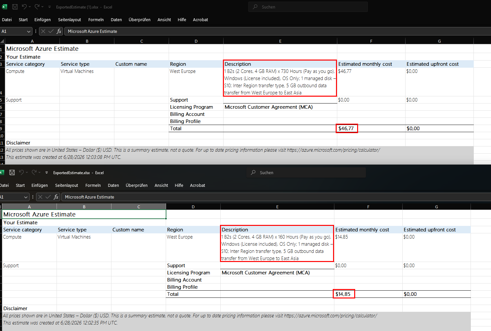
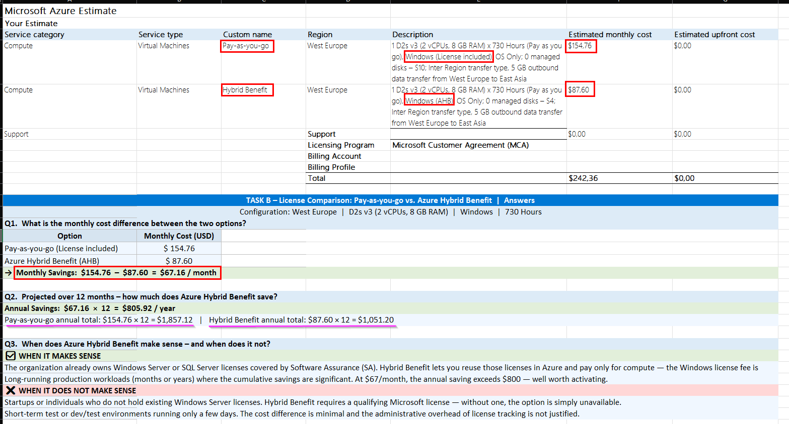
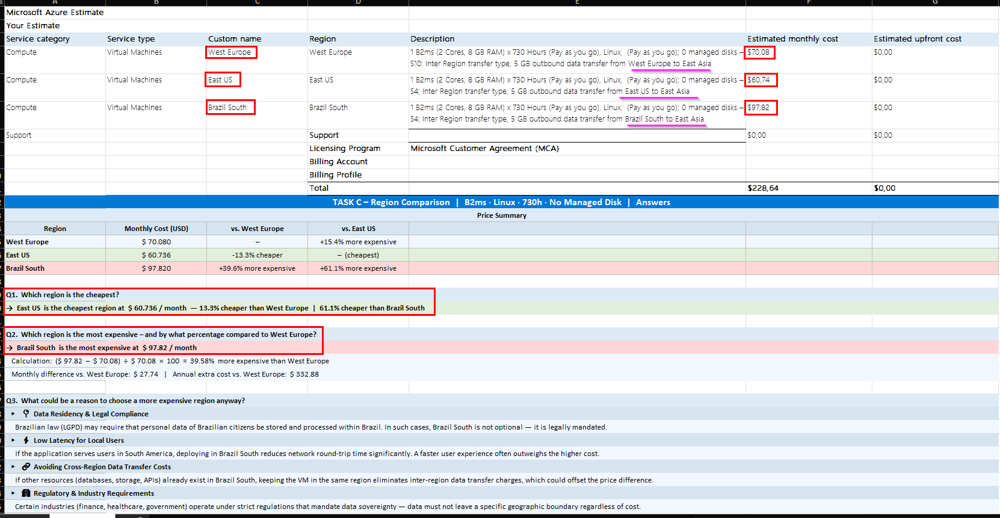
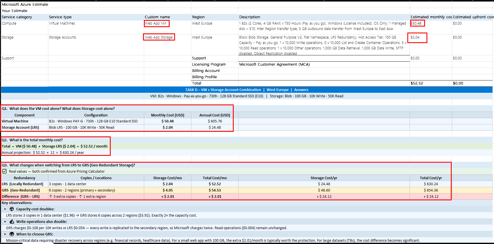
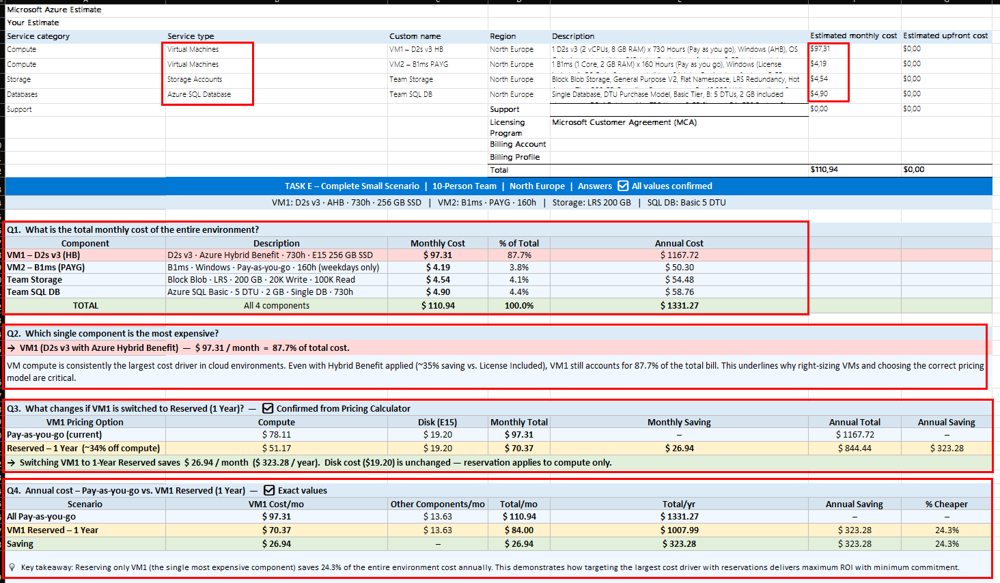
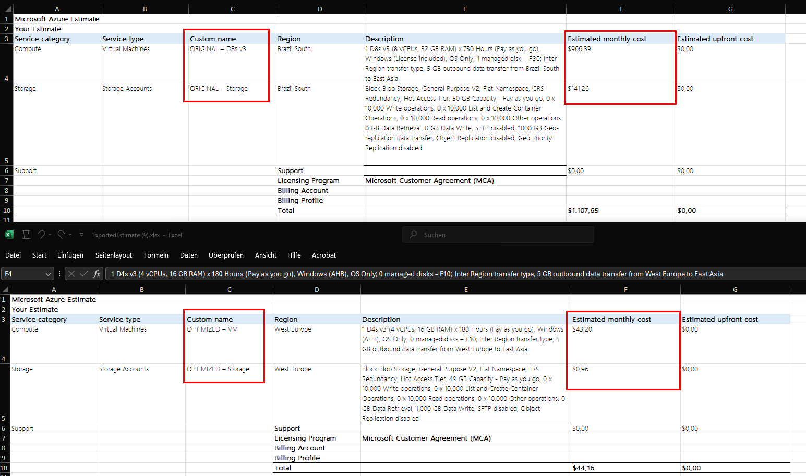
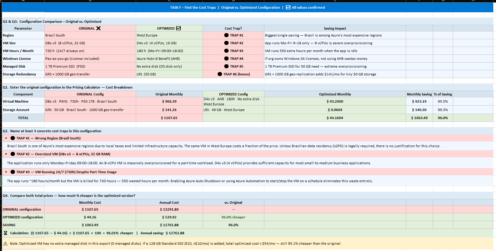

# ☁️ Azure Pricing Calculator Lab


---

> **[Deutsch](#-deutsch)** · **[English](#-english)**

---

<br>

## Deutsch

Hands-on Kostenanalyse mit dem [Azure Pricing Calculator](https://azure.microsoft.com/pricing/calculator) — 6 Szenarien von der einfachen VM-Kalkulation bis zur Kostenfallen-Analyse.

📄 [Aufgabendokument (PDF)](docs/azure-cost-lab-tasks.pdf)

### Inhaltsverzeichnis

| # | Aufgabe | Thema | Schwierigkeit |
|---|---------|-------|--------------|
| [A](#aufgabe-a--eine-einzelne-vm-kalkulieren) | Aufgabe A | Einzelne VM kalkulieren | 🟢 Leicht |
| [B](#aufgabe-b--lizenzvergleich) | Aufgabe B | Hybrid Benefit vs. Pay-as-you-go | 🟢 Leicht |
| [C](#aufgabe-c--regionsvergleich) | Aufgabe C | Regionsvergleich | 🟢 Leicht |
| [D](#aufgabe-d--vm--storage-account) | Aufgabe D | VM + Storage Account | 🟡 Mittel |
| [E](#aufgabe-e--vollständiges-szenario) | Aufgabe E | Vollständiges Team-Szenario | 🟡 Mittel |
| [F](#aufgabe-f--kostenfallen-finden) | Aufgabe F | Kostenfallen finden | 🟠 Mittel+ |

### Kostenübersicht

| Aufgabe | Konfiguration | Monatlich |
|---------|--------------|-----------|
| **A** | B2s · Windows · 730h · West Europe | $46.77 |
| **A** | B2s · Windows · 160h · West Europe | $14.85 |
| **B** | D2s v3 · Pay-as-you-go · West Europe | $154.76 |
| **B** | D2s v3 · Hybrid Benefit · West Europe | $87.60 |
| **C** | B2ms · Linux · East US *(günstigste)* | $60.74 |
| **C** | B2ms · Linux · Brazil South *(teuerste)* | $97.82 |
| **D** | B2s + Blob LRS 100 GB · West Europe | $52.52 |
| **E** | 2× VMs + Storage + SQL DB · North Europe | $110.94 |
| **F** | Original — schlechte Konfiguration | $1,107.65 |
| **F** | Optimiert | $44.16 |

---

#### Aufgabe A — Eine einzelne VM kalkulieren

Monatliche Kosten eines Windows-Testservers berechnen — dann die Laufzeit auf Werktage reduzieren.

**Konfiguration:** `B2s` · `Windows` · `West Europe` · `128 GB Standard HDD` · `Pay-as-you-go`

| Szenario | Stunden | Monatlich |
|----------|---------|-----------|
| 24/7 ganzer Monat | 730h | **$46.77** |
| Nur Werktage (Mo–Fr, 8h/Tag) | 160h | **$14.85** |
| 💾 Nur Disk (S10) | — | **≈ $5.28** |

> 💡 Laufzeit von 730h auf 160h reduzieren spart ~68%. Disk-Kosten laufen weiter, auch wenn die VM ausgeschaltet ist.

---

#### Aufgabe B — Lizenzvergleich

Gleiche VM, zwei Lizenzmodelle — wie viel spart Azure Hybrid Benefit?

**Konfiguration:** `D2s v3` · `Windows` · `West Europe` · `730h`

| Option | Monatlich | Jährlich |
|--------|-----------|----------|
| Pay-as-you-go | $154.76 | $1,857.12 |
| Azure Hybrid Benefit | $87.60 | $1,051.20 |
| 💚 Ersparnis | **$67.16 / Monat** | **$805.92 / Jahr** |

> 💡 AHB spart ~43% bei der Windows-Lizenz. Sinnvoll für Unternehmen mit bestehenden SA-Lizenzen.

---

#### Aufgabe C — Regionsvergleich

Azure-Preise unterscheiden sich je nach Region. Dieselbe Linux-VM in 3 Regionen vergleichen.

**Konfiguration:** `B2ms` · `Linux` · `730h` · Kein Managed Disk

| Region | Monatlich | vs. West Europe |
|--------|-----------|----------------|
| 🟢 **East US** | $60.74 | −13,3% |
| 🟡 **West Europe** | $70.08 | — |
| 🔴 **Brazil South** | $97.82 | **+39,6%** |

> 💡 Brazil South ist ~40% teurer wegen lokaler Steuern. East US hat das größte Microsoft-Rechenzentrum.

---

#### Aufgabe D — VM + Storage Account

Kleine Web-App: VM mit Blob Storage. LRS vs. GRS Redundanz vergleichen.

**Konfiguration:** `B2s` · `Windows` · `730h` · `128 GB Standard SSD` + `Blob 100 GB` · `West Europe`

| Komponente | Monatlich |
|------------|-----------|
| VM (B2s + E10 SSD) | $50.48 |
| Storage LRS | $2.04 |
| **Gesamt (LRS)** | **$52.52** |
| Gesamt (GRS) | $54.53 |
| GRS Mehrkosten | +$2.01/Monat |

> 💡 GRS verdoppelt die Kapazitätskosten UND die Schreibkosten — jeder Write wird in eine zweite Region repliziert.

---

#### Aufgabe E — Vollständiges Szenario

Vollständige Umgebung für 10 Personen: 2 VMs, Storage, SQL-Datenbank.

**Konfiguration:** `North Europe` · D2s v3 (AHB) · B1ms · LRS 200 GB · SQL Basic

| Komponente | Monatlich | % der Kosten |
|------------|-----------|-------------|
| VM1 — D2s v3 (AHB) | $97.31 | 87,7% |
| VM2 — B1ms (160h) | $4.19 | 3,8% |
| Storage LRS 200 GB | $4.54 | 4,1% |
| SQL DB Basic | $4.90 | 4,4% |
| **Gesamt (PAYG)** | **$110.94** | |
| **Gesamt (VM1 Reserved 1 Jahr)** | **$84.00** | |
| 💚 Jährliche Ersparnis | — | **$323.28 (24,3%)** |

> 💡 VM-Compute macht 87,7% der Gesamtkosten aus. Nur VM1 zu reservieren spart $323 pro Jahr.

---

#### Aufgabe F — Kostenfallen finden

Eine schlecht konfigurierte Umgebung mit 6 Kostenfallen. Finden, beheben, Ersparnis messen.

| # | Kostenfalle | Original | Optimiert |
|---|------------|----------|-----------|
| 🔴 1 | Region | Brazil South | West Europe |
| 🔴 2 | VM-Größe | D8s v3 (8 vCPU) | D4s v3 (4 vCPU) |
| 🔴 3 | Laufzeit | 730h (24/7) | 180h (Mo–Fr 09–18) |
| 🔴 4 | Lizenz | Pay-as-you-go | Hybrid Benefit |
| 🔴 5 | Disk | 1 TB Premium SSD | 128 GB Standard SSD |
| 🔴 6 | Storage | GRS + 1000 GB Transfer | LRS 50 GB |

| | Monatlich | Jährlich |
|--|-----------|----------|
| 🔴 Original | $1,107.65 | $13,291.80 |
| 🟢 Optimiert | $44.16 | $529.92 |
| 💚 **Ersparnis** | **$1,063.49** | **$12,761.88** |

## 🏆 96% günstiger — 6 Kostenfallen behoben

> 💡 Eine schlechte Konfiguration kann 25× teurer sein als eine optimierte.

---

### 🧠 Wichtigste Erkenntnisse

| # | Erkenntnis |
|---|-----------|
| 1 | 🌍 Die Region ist entscheidend — bis zu 40% Preisunterschied |
| 2 | 🪟 Hybrid Benefit spart ~43% bei Windows-Lizenzen |
| 3 | ⏱️ Idle VMs stoppen ist der schnellste Spareffekt |
| 4 | 📦 Überdimensionierte VMs und Disks sind stille Kostenkiller |
| 5 | 💾 GRS verdoppelt Storage- UND Schreibkosten |
| 6 | 📅 Reserved Instances sparen ~34% bei stabilen Workloads |
| 7 | 🔍 Eine schlechte Konfiguration kann 25× teurer sein |

---

<br>

## English

Hands-on cost analysis using the [Azure Pricing Calculator](https://azure.microsoft.com/pricing/calculator) — 6 real-world scenarios from single VM pricing to finding costly misconfigurations.

📄 [Original Task Document (PDF)](docs/azure-cost-lab-tasks.pdf)

### Table of Contents

| # | Task | Topic | Difficulty |
|---|------|--------|------------|
| [A](#task-a--single-vm-pricing) | Task A | Single VM Pricing | 🟢 Easy |
| [B](#task-b--license-comparison) | Task B | Hybrid Benefit vs. Pay-as-you-go | 🟢 Easy |
| [C](#task-c--region-comparison) | Task C | Region Price Comparison | 🟢 Easy |
| [D](#task-d--vm--storage-account) | Task D | VM + Storage Account | 🟡 Medium |
| [E](#task-e--full-scenario) | Task E | Full Team Environment | 🟡 Medium |
| [F](#task-f--find-the-cost-traps) | Task F | Find the Cost Traps | 🟠 Medium+ |

### Cost Summary

| Task | Configuration | Monthly |
|------|--------------|---------|
| **A** | B2s · Windows · 730h · West Europe | $46.77 |
| **A** | B2s · Windows · 160h · West Europe | $14.85 |
| **B** | D2s v3 · Pay-as-you-go · West Europe | $154.76 |
| **B** | D2s v3 · Hybrid Benefit · West Europe | $87.60 |
| **C** | B2ms · Linux · East US *(cheapest)* | $60.74 |
| **C** | B2ms · Linux · Brazil South *(most expensive)* | $97.82 |
| **D** | B2s + Blob LRS 100 GB · West Europe | $52.52 |
| **E** | 2× VMs + Storage + SQL DB · North Europe | $110.94 |
| **F** | Original — bad config | $1,107.65 |
| **F** | Optimized | $44.16 |

---

#### Task A — Single VM Pricing

Calculate the monthly cost of a Windows test server — then reduce runtime to weekdays only.

**Config:** `B2s` · `Windows` · `West Europe` · `128 GB Standard HDD` · `Pay-as-you-go`

| Scenario | Hours | Monthly |
|----------|-------|---------|
| 24/7 full month | 730h | **$46.77** |
| Weekdays only (Mo–Fr, 8h/day) | 160h | **$14.85** |
| 💾 Disk only (S10) | — | **≈ $5.28** |

> 💡 Reducing runtime from 730h → 160h saves ~68%. Disk cost stays the same whether the VM is on or off.


*Two exports: 730h full month vs 160h weekdays only*

---

#### Task B — License Comparison

Same VM, two licensing options — see how much Azure Hybrid Benefit saves.

**Config:** `D2s v3` · `Windows` · `West Europe` · `730h`

| Option | Monthly | Annual |
|--------|---------|--------|
| Pay-as-you-go | $154.76 | $1,857.12 |
| Azure Hybrid Benefit | $87.60 | $1,051.20 |
| 💚 Saving | **$67.16 / mo** | **$805.92 / yr** |

> 💡 AHB saves ~43% on Windows licensing. Best for orgs with existing Windows Server SA licenses.


*Pay-as-you-go vs Azure Hybrid Benefit — $67.16/month difference*

---

#### Task C — Region Comparison

Azure prices vary by region. Compare the same Linux VM across 3 regions.

**Config:** `B2ms` · `Linux` · `730h` · No managed disk

| Region | Monthly | vs. West Europe |
|--------|---------|----------------|
| 🟢 **East US** | $60.74 | −13.3% |
| 🟡 **West Europe** | $70.08 | — |
| 🔴 **Brazil South** | $97.82 | **+39.6%** |

> 💡 Brazil South is ~40% more expensive due to local taxes. East US benefits from Microsoft's largest data center footprint.


*3 regions, same VM — up to 39.6% price difference*

---

#### Task D — VM + Storage Account

Small web app setup: VM with Blob Storage. Compare LRS vs GRS redundancy.

**Config:** `B2s` · `Windows` · `730h` · `128 GB Standard SSD` + `Blob 100 GB` · `West Europe`

| Component | Monthly |
|-----------|---------|
| VM (B2s + E10 SSD) | $50.48 |
| Storage LRS | $2.04 |
| **Total (LRS)** | **$52.52** |
| Total (GRS) | $54.53 |
| GRS extra | +$2.01/mo |

> 💡 GRS doubles capacity cost AND write operation cost — every write is replicated to a second region.


*VM + Blob Storage — LRS vs GRS cost breakdown*

---

#### Task E — Full Scenario

Full environment for a team of 10: 2 VMs, Storage, SQL Database.

**Config:** `North Europe` · D2s v3 (AHB) · B1ms · LRS 200 GB · SQL Basic

| Component | Monthly | % of Total |
|-----------|---------|-----------|
| VM1 — D2s v3 (AHB) | $97.31 | 87.7% |
| VM2 — B1ms (160h) | $4.19 | 3.8% |
| Storage LRS 200 GB | $4.54 | 4.1% |
| SQL DB Basic | $4.90 | 4.4% |
| **Total (PAYG)** | **$110.94** | |
| **Total (VM1 Reserved 1yr)** | **$84.00** | |
| 💚 Annual saving | — | **$323.28 (24.3%)** |

> 💡 VM compute accounts for 87.7% of the bill. Reserving just VM1 saves $323/year.


*4 services — VM1 = 87.7% of total cost*

---

#### Task F — Find the Cost Traps

A poorly configured environment with 6 cost traps. Find them, fix them, measure the saving.

| # | Trap | Original | Fixed |
|---|------|----------|-------|
| 🔴 1 | Region | Brazil South | West Europe |
| 🔴 2 | VM Size | D8s v3 (8 vCPU) | D4s v3 (4 vCPU) |
| 🔴 3 | Runtime | 730h (24/7) | 180h (Mo–Fr 09–18) |
| 🔴 4 | License | Pay-as-you-go | Hybrid Benefit |
| 🔴 5 | Disk | 1 TB Premium SSD | 128 GB Standard SSD |
| 🔴 6 | Storage | GRS + 1000 GB transfer | LRS 50 GB |

| | Monthly | Annual |
|--|---------|--------|
| 🔴 Original | $1,107.65 | $13,291.80 |
| 🟢 Optimized | $44.16 | $529.92 |
| 💚 **Saving** | **$1,063.49** | **$12,761.88** |

## 🏆 96% cheaper — 6 traps fixed

> 💡 One bad config can cost 25× more than an optimized equivalent.


*Original vs Optimized — Pricing Calculator exports*


*All 6 cost traps identified and fixed*

---

### 🧠 Key Takeaways

| # | Lesson |
|---|--------|
| 1 | 🌍 Region matters — up to 40% price difference |
| 2 | 🪟 Hybrid Benefit saves ~43% on Windows licensing |
| 3 | ⏱️ Shutting down idle VMs is the fastest win |
| 4 | 📦 Oversized VMs and disks are silent cost killers |
| 5 | 💾 GRS doubles storage AND write costs |
| 6 | 📅 Reserved Instances save ~34% on stable workloads |
| 7 | 🔍 One bad config can cost 25× more |

---

### 🛠️ Tools Used


---

### 📁 Repository Structure

```
azure-pricing-lab/
├── 📄 README.md
├── 📁 docs/
│   └── azure-cost-lab-tasks.pdf
└── 📁 tasks/
    ├── A-single-vm/screenshots/
    ├── B-hybrid-benefit/screenshots/ + exports/
    ├── C-region-comparison/screenshots/ + exports/
    ├── D-vm-storage/screenshots/ + exports/
    ├── E-full-scenario/screenshots/ + exports/
    └── F-cost-traps/screenshots/ + exports/
```

---

> *Prices in USD — Azure Pricing Calculator, June 2026. Prices may vary.*
